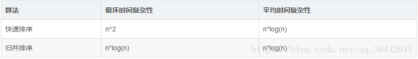

# 归并排序

## 原理
归并排序是基于分治法，将待排序的元素序列分成两个长度相等的子序列，为每个字序列排序，然后再将它们合并成一个子序列。合并两个字序列的过程也就是两路归并。

## 复杂度
一种稳定的排序算法，主要问题在于不是就地排序，它需要一个与待排序数组一样大的辅助空间。由于每次划分时两个子序列长度基本一致，所以最好、最差以及平均复杂度都是nlog2n。具体nlog2n怎么推算，见算法导论，大概思想就是会比较多少层，根据层数算法时间复杂度。

## 图解排序过程

## 同快排对比
* 处理不同数组长度下执行时间：

* 时间复杂度对比

* 数组小于1000w曲线图

* 亿级数据量对比

> 参考了网络资料
> https://blog.csdn.net/qq_36442947/article/details/81612870